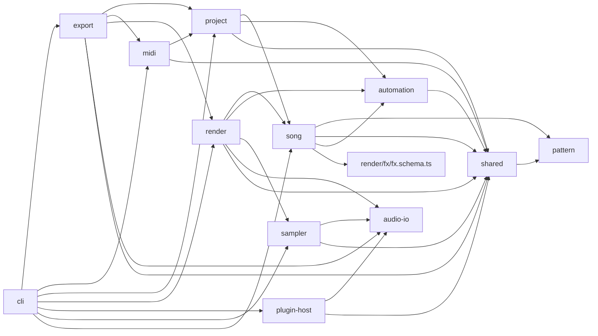

# 260928 music2 DAW bridge — architect proposal

Scope: read-only architecture pass over HEAD `8d85e25` (music2-gen). This is the only file written. All
`path:line` references are relative to the repository root and were read at that commit. The proposal covers
wp2..wp10 of the DAW-bridge unit: ProjectIR, Song v1 extensions, MIDI, stems, sampler, automation, Ableton,
DAWproject, plugin bridge and docs.

## Evidence baseline (facts the decisions below rely on)

| # | Fact | Evidence |
|---|---|---|
| E1 | Timeline positions are float seconds computed from exact fractions; the fraction survives only as a string. | `src/song/timeline.tool.ts:58-59` (`time = (startBar + Number(onset)) * secondsPerBar + swingShift`), `:66` (`cycleBegin: onset.toString()`), `src/shared/rational.tool.ts:90-92` |
| E2 | Swing is a float offset in seconds (not rational). | `src/song/timeline.tool.ts:25-29` |
| E3 | Meter denominator is fixed to 4, so a beat is always a quarter note. | `src/song/song.schema.ts:13`, `:100` |
| E4 | `song.schema.ts` is 369 lines and `mixer.tool.ts` is 366 lines; the repo rule is about 400 lines, and the audit hard cap is 500. | `wc -l`, `AGENTS.md:14`, `scripts/structure-audit.mjs:57` |
| E5 | 29 non-test sites branch on `kind === "notes"/"drums"` (lint, analyze, recipes, render, usecases). | `rg 'kind === "(notes\|drums)"'` over `src`, e.g. `src/recipes/lint-geometry.tool.ts`, `src/analyze/pianoroll.tool.ts` |
| E6 | The hand-written validator special-cases `oneOf` branches whose objects have a `type` property, treating them as effect discriminators. It has no `if/then`, `anyOf`, `uniqueItems` or exclusive bounds. | `src/song/song.schema.ts:137-154`, `:155-193` |
| E7 | Every object rule is `additionalProperties:false`, so older validators reject new keys; new keys are therefore a pure superset. | `src/song/song.schema.ts:113-121`, `:123-127` |
| E8 | `render` validates voices/samples, builds the Timeline, then calls `mixTracks`; the mixer consumes `TimedEvent.time` seconds. | `src/render/render.tool.ts:47-63`, `src/render/mixer.tool.ts:24-41` |
| E9 | `kit:` is the only non-voice instrument; kit/voice decisions are prefix checks. | `src/render/voices/registry.tool.ts:43`, `:49`, `:69`; `src/render/mixer.tool.ts:50`, `:273` |
| E10 | Voice contract is one constant `params` object per track render; `VoiceEvent` already carries a per-event `seed`. | `src/render/render.schema.ts:7`, `:10`; `src/render/mixer.tool.ts:39`, `:314` |
| E11 | Insert processors are synchronous and whole-buffer. | `src/render/fx/fx.schema.ts:62-64`, `src/render/fx/index.ts:25` |
| E12 | Dry stems are post gain/pan/duck and pre-send; wet bus returns are summed into master and discarded; loop stems are truncated, while master tails are folded. | `src/render/mixer.tool.ts:79`, `:338-347`, `:349-358` |
| E13 | `render` output replaces existing files with `rename`; `sfx` refuses existing files with `link()` and returns `E_ACCESS`. | `src/cli/commands/render.ts:118`; `src/cli/commands/sfx.ts:38-45`, `:91-93`, `:105-110` |
| E14 | Input/output identity collision check exists privately in render CLI and returns `E_INPUT`. | `src/cli/commands/render.ts:41-51` |
| E15 | Exit mapping: E_INPUT/E_SCHEMA/E_PARSE/E_NOT_FOUND→2, E_CAPABILITY/E_FFMPEG_MISSING→3, E_ACCESS/E_PROVIDER→4, E_RENDER→5, E_QA→6, E_TIMEOUT/E_INTERRUPTED→7. | `src/shared/errors.tool.ts:3-17`, `AGENTS.md:21` |
| E16 | Registry is a flat name→spec map; two-word commands use a positional sub-verb (`skill path`). | `src/cli/registry.ts:48-55`, `src/cli/commands/skill-path.ts:17-26` |
| E17 | The `--json` envelope is one object: `{ok,command,data,artifacts,warnings,meta}`. | `src/cli/output.ts:4-12`, `:19-33` |
| E18 | Legacy byte identity is pinned by sha256 on darwin/Node 24 only. | `tests/e2e/legacy-render.test.ts:10-15`, `:27-39`; `src/render/mixer.test.ts:25-37`; `src/render/render.test.ts:145` |
| E19 | Determinism primitives: `fnv1a32` and `mulberry32`; WAV dither is seeded per artifact. | `src/shared/prng.tool.ts:4-29`; `src/cli/commands/render.ts:101`, `:113-114`; `src/audio-io/wav.tool.ts:97-102` |
| E20 | `analyze` and `critic` import `render`; `render` imports `song`; `song` imports the declarative `render/fx/fx.schema.ts`. | `src/analyze/analyze.tool.ts:5`, `src/critic/critic.tool.ts:9`, `src/render/render.tool.ts:4`, `src/song/song.schema.ts:4-5` |
| E21 | Kit loading confines manifests and samples to the kit directory with realpath and rejects unknown manifest keys. | `src/render/kit.tool.ts:15-18`, `:23-24`, `:51-78` |
| E22 | Kit playback uses linear interpolation; kit samples are folded to mono. | `src/render/kit.tool.ts:88-90`, `:112-121` |
| E23 | `usecases` rewrites `arrangement`. | `src/usecases/usecase.tool.ts:73-92` |
| E24 | `events --json` spreads each TimedEvent; `validate --json` lists only `song.tracks`. | `src/cli/commands/events.ts:32-35`, `src/cli/commands/validate.ts:13-16` |
| E25 | Node 24.17 on the recording host provides `zlib.crc32`. `gzipSync` writes header OS byte `0x13` on darwin (`1f8b0800000000000013`), so gzip bytes are platform-dependent unless patched. | local `node -e` probe; `package.json` engines `>=22.18` |
| E26 | `writeWav` is path-based and has no in-memory encoder. | `src/audio-io/wav.tool.ts:102-134` |

---

## F1 — Tick math lives in `src/shared/ticks.tool.ts` (PPQ 960)

**Decision.** Add `src/shared/ticks.tool.ts` (+ test), re-exported from `src/shared/index.ts`:

```ts
export const PPQ = 960;
export function barTicks(numerator: number): number;                 // numerator * PPQ (denominator is always 4)
export function beatsToTicks(beats: number): number;                 // round-half-up(beats * PPQ); E_INTERNAL if unsafe
export function ticksToSeconds(ticks: number, bpm: number): number;  // ticks * 60 / (bpm * PPQ)
export function secondsToTicks(seconds: number, bpm: number): number; // round-half-up
export function fractionToTicks(bars: Fraction, numerator: number): { ticks: number; exact: boolean };
```

**Rationale.** `song` must convert beat positions of the new note, clip and automation fields to ticks during
resolution. `project`, `render`, `midi` and `export` must use the same conversion. If tick math lived in
`src/project`, `song → project → song` would form a cycle, because `project` builds from `ResolvedSong` (E20). A beat equals
one quarter because the meter denominator is fixed at 4 (E3), so a tick is always 1/960 of a beat and a bar is `numerator*960`.

**Risk.** Low. Rounding convention must be single-sourced (half-up on non-negative values); add vectors for
1/3, 1/5, 1/7 bar tuplets (1/7 of a 4/4 bar is 548.57 ticks → inexact).

## F2 — Render keeps float-second pattern events; ProjectIR is the exchange projection

**Decision.** Render does not consume ProjectIR in this unit. Both render and exporters derive from one source,
`ResolvedSong` + `Timeline`. For objects introduced by this unit (list notes, audio clips and automation points),
song resolution stores **integer ticks**. Render and exporters convert them with the same `ticksToSeconds` (F1), so
their positions are identical by construction. Pattern events keep their current float-second times in render. ProjectIR
quantizes them to ticks for export and reports the quantization error.

**Rationale.** Pattern events are exact fractions plus a float swing offset (E1, E2). Re-timing them through 960-PPQ ticks would move
tuplets and swung notes by up to half a tick. At 40 bpm, that is 0.78 ms, or 34 samples at 44.1 kHz. That changes the legacy bytes pinned in E18.
Sharing the tick domain only for tick-native objects keeps the requirement that one tick timeline is shared by render and exporters
wherever it can hold exactly. It also avoids changing legacy output.

**Risk.** Medium, and visible to users. A MIDI/ALS export of a swung or 1/7-tuplet song is not sample-identical to the
music2 render. Mitigation: ProjectIR `quantization` counters (F3) go into every export's `data` and `warnings`.

## F3 — ProjectIR types (`src/project/project.schema.ts`)

**Decision.**

```ts
export interface ProjectIR {
  version: 1; ppq: 960;
  title: string; seed: number; sampleRate: 44100 | 48000; tailSeconds: number; loop: boolean;
  lengthTicks: number;                                        // arrangement body = bars * barTicks
  tempo: { tick: number; bpm: number }[];                     // exactly one point today; array for exporters
  meter: { tick: number; numerator: number; denominator: 4 }[]; // exactly one point today
  key: { tonic: string; mode: "major" | "minor" } | null;
  markers: ProjectMarker[];                                   // one per arrangement placement
  tracks: ProjectTrack[];                                     // song.tracks order, then song.audioTracks order
  buses: { reverb: ProjectBus | null; delay: ProjectBus | null };
  master: { gainDb: number; ceilingDb: number; targetLufs: number | null; inserts: ResolvedInsert[] };
  samples: ProjectSample[];                                   // de-duplicated external files, song-relative POSIX paths, sorted
  quantization: { events: number; inexact: number; maxErrorTicks: number };
}
export interface ProjectMarker {
  tick: number; lengthTicks: number; name: string;            // name = section id, "<id> (n)" for occurrence n>0
  section: string; role: SectionRole | null; ordinal: number; occurrence: number;
}
export interface ProjectBus { kind: "reverb" | "delay"; legacy: boolean; params: ReverbBusParams | DelayBusParams | null }
interface ProjectTrackBase {
  id: string; index: number; gainDb: number; pan: number;
  sends: { reverb: number; delay: number }; inserts: ResolvedInsert[];
  duck: { by: string; amount: number; releaseMs: number } | null;
  automation: ResolvedLane[];                                 // from src/automation, tick-positioned
}
export type ProjectInstrument =
  | { kind: "voice"; id: string; params: Record<string, number> }
  | { kind: "kit"; ref: string } | { kind: "sfz"; ref: string };
export interface ProjectNoteTrack extends ProjectTrackBase {
  type: "notes" | "drums"; instrument: ProjectInstrument; mono: boolean; notes: ProjectNote[];
}
export interface ProjectAudioTrack extends ProjectTrackBase { type: "audio"; clips: ProjectClip[] }
export type ProjectTrack = ProjectNoteTrack | ProjectAudioTrack;
export interface ProjectNote {
  tick: number; lengthTicks: number;                          // lengthTicks >= 1
  pitch: number | null; sample: { name: string; index: number } | null;
  velocity: number;                                           // 0..1, as rendered
  eventIndex: number;                                         // same per-track counter as mixer seeds (mixer.tool.ts:30-39)
  source: "pattern" | "list"; errorTicks: number;             // |exact - tick|, 0 for list notes
}
export interface ProjectClip {
  tick: number; lengthTicks: number; sample: number;          // index into ProjectIR.samples
  offsetSeconds: number; gainDb: number; pitchSemitones: number;
  stretch: ResolvedStretch; fadeInSeconds: number; fadeOutSeconds: number;
}
export interface ProjectSample { ref: string; role: "clip" | "kit" | "sfz" }
```

`buildProject(song: ResolvedSong, timeline: Timeline): ProjectIR` is pure, with no filesystem access. `src/project/build.tool.ts` builds it.
File existence and hashing belong to exporters and render.

**Rationale.** It includes everything that MIDI, stems, ALS and DAWproject need: a tempo/meter map, markers from `arrange`
placements (`src/song/arrange.tool.ts:3-6`), mixer state (gain/pan/sends/inserts/buses from `ResolvedSong`, E12), and sample
references. `eventIndex` matches the mixer's seed addressing (`src/render/mixer.tool.ts:30-31`, `:39`), so a later
freeze or audit can correlate notes with rendered voices.

**Risk.** Low. Arrays for tempo and meter invite callers to assume they can change mid-song. Validators
assert length 1 until a later unit adds tempo automation.

## F4 — Quantizing pattern events into ProjectIR

**Decision.** For each `TimedEvent` (E1):

1. Parse `cycleBegin` (`"n"` or `"n/d"`) into a `Fraction` `onset`; exact bar position = `event.bar + (onset − floor(onset))`
   (valid because `event.bar = placement.startBar + floor(onset)`, `src/song/timeline.tool.ts:57`).
2. `exactTick` = `fractionToTicks(position, numerator)`; swing ticks = `secondsToTicks(event.time − exactSeconds, bpm)`.
3. `lengthTicks = max(1, secondsToTicks(event.duration, bpm))`; mono tracks additionally clip to the next onset,
   matching the mixer's mono stop (`src/render/mixer.tool.ts:45-49`).
4. Accumulate `quantization.events/inexact/maxErrorTicks`.

Do **not** add an exact-position field to `TimedEvent`.

**Rationale.** A new `TimedEvent` field would change `events --json` output for every legacy song, because the command spreads the
event (E24). Parsing `cycleBegin` recovers the exact rational without changing any public shape.

**Risk.** Low. Test with swing 0.58 (38.4 ticks → 38) and with `<a b c>`/`{...}` alternations across placements.

## F5 — Song v1 extension: explicit note lists (`track.notes`)

**Decision.** Add an optional `notes` property to the existing `Track` (both kinds):

```json
{ "id": "lead", "kind": "notes", "instrument": "piano",
  "notes": [ { "start": 0, "length": 1.5, "pitch": "e4", "velocity": 0.9 },
             { "start": 2, "length": 0.5, "pitch": 64 } ] }
{ "id": "kit", "kind": "drums", "instrument": "drums",
  "notes": [ { "start": 0, "length": 0.25, "sample": "bd:1" } ] }
```

- `start`: number ≥ 0, in **beats (quarter notes) from song start**. It is arrangement-absolute.
- `length`: number ≥ 0.001 beats; resolves to at least 1 tick.
- `pitch`: `oneOf [integer 0..127, note-name string]`; required when `kind:"notes"` and forbidden for drums.
- `sample`: sample reference string (same parser as drum atoms, `src/song/song.schema.ts:281-282`); required for drums and forbidden for notes.
- `velocity`: 0..1; the default is the numeric `track.velocity`, otherwise 0.8.
- `maxItems` 20000, the same as the timeline event limit (`src/song/timeline.tool.ts:68`).

Validation issues use the existing `E_SCHEMA` envelope and `$` paths (`src/song/song.schema.ts:344`):

| Condition | Path | Message |
|---|---|---|
| `notes` and `pattern` both present | `$.tracks[i].notes` | `notes and pattern are exclusive` |
| a section override names a list track | `$.sections[j].patterns.<id>` | `track uses notes` |
| string `velocity` on a list track | `$.tracks[i].velocity` | `velocity pattern requires pattern` |
| `swing:true` on a list track | `$.tracks[i].swing` | `swing does not apply to notes` |
| pitch on drums, or sample on notes | `$.tracks[i].notes[k].pitch\|sample` | `not allowed for <kind> track` |
| `start` ≥ arrangement body length | `$.tracks[i].notes[k].start` | `starts after song end (<beats> beats)` |

Semantics: `transpose` applies, as in `src/song/timeline.tool.ts:60-61`; `gate` does not, because `length` is the sounding
length; mono voices still stop at the next onset. Resolution sorts notes stably by (tick, pitch/sample, input index).

**Rationale.** Keeping list notes on existing tracks avoids a new `kind`. With no new kind, the 29 kind branches (E5) still
work. Exclusivity with `pattern` keeps the exporter simple: each track has exactly one source of events.

**Risk.** Medium. Absolute notes do not move when the arrangement changes. `usecases` rewrites arrangements (E23), and
`recipes` lint reasons about effective patterns (`src/recipes/lint-geometry.tool.ts:157`). See F28 and open question Q1.

## F6 — Song v1 extension: audio-clip tracks as a separate `audioTracks` array

**Decision.** Add top-level optional `audioTracks` (0..16). The design does not use `kind:"audio"`:

```json
"audioTracks": [{
  "id": "vox", "gain": -3, "pan": 0.1, "sends": { "reverb": 0.2 },
  "fx": [ { "type": "eq", "highGainDb": 2 } ],
  "duck": { "by": "kick", "amount": 0.3 },
  "automation": [ ... ],
  "clips": [ { "file": "audio/vox-take3.wav", "start": 16, "length": 32, "offset": 0.25,
               "gain": -2, "pitch": 0, "stretch": { "mode": "tempo", "sourceBpm": 92 },
               "fadeIn": 0.005, "fadeOut": 0.05 } ]
}]
```

- Track fields reuse the existing rules for `id`, `gain`, `pan`, `sends`, `fx` and `duck` (`src/song/song.schema.ts:78-89`).
  `kind`, `instrument`, `pattern`, `params`, `mono`, `gate` and `glide` are unknown keys.
- `clips` 1..256: `file` must be a relative `.wav` path (regex rejects leading `/`, drive letters and NUL). `start` ≥ 0 beats,
  `length` > 0 beats and required, so validation stays pure. `offset` ≥ 0 seconds into the source, default 0.
  `gain` is −60..12 dB, default 0. `pitch` is −24..24 semitones (fractional allowed), default 0. `fadeIn`/`fadeOut` are 0..10 s,
  default 0.002.
- `stretch` is **one** object with an enum `mode`. It is not a `oneOf` of objects, because of the validator trap in E6:
  `none` (default, source rate, truncated at `length`), `varispeed` (`ratio` 0.25..4, pitch follows), `tempo`
  (`sourceBpm` 40..300, pitch-preserving, ratio = bpm/sourceBpm), and `fit` (pitch-preserving stretch of the source region to exactly
  `length`, which requires `sourceSeconds`). Code-level checks enforce which keys each mode requires.
- Cross checks: track IDs share one namespace across `tracks` and `audioTracks` (`duplicate track id`). Clips in one track
  must not overlap (`$.audioTracks[i].clips[k]` `overlaps clip <k-1>`), which matches DAW lane semantics. `duck.by` must name an
  event-bearing entry in `tracks`, because ducking uses event onsets (`src/render/mixer.tool.ts:316-319`). Section overrides cannot
  name audio tracks; they already fail with `unknown track`, because `trackIds` is built from `tracks` only (`src/song/song.schema.ts:299-307`, `:323`).
- Resolved: `ResolvedSong.audioTracks?: ResolvedAudioTrack[]`. It is absent when the input omits it (F9). Positions are stored in ticks.

**Rationale.** Widening `Track.kind` would force audits of all 29 kind branches (E5). Many of them are binary `=== "notes"`/else
tests, so audio would silently fall into drum logic. A separate array leaves lint, analyze, recipes and usecases unchanged for every
existing song. It also puts all new mixer work in a separate loop after the instrument tracks (F11).

**Risk.** Medium. Track order in DAW exports becomes `tracks` followed by `audioTracks`, and users cannot interleave the two. Accept this and
record the tradeoff in the docs. Clip files are read at render time and confined to the song directory; see F20 and Q4.

## F7 — Song v1 extension: automation lanes (`automation` on tracks and audio tracks)

**Decision.**

```json
"automation": [
  { "target": "gain",          "points": [ { "at": 0, "value": -12 }, { "at": 16, "value": 0 } ] },
  { "target": "send.reverb",   "points": [ { "at": 30, "value": 0 }, { "at": 32, "value": 0.6, "curve": "hold" } ] },
  { "target": "fx.0.cutoffHz", "points": [ { "at": 0, "value": 400 }, { "at": 8, "value": 4000 } ] },
  { "target": "param.cutoffHz","points": [ { "at": 0, "value": 300 }, { "at": 64, "value": 2400 } ] }
]
```

- `target` regex: `^(gain|pan|send\.(reverb|delay)|fx\.(0|[1-9][0-9]?)\.[A-Za-z][A-Za-z0-9]*|param\.[A-Za-z][A-Za-z0-9]*)$`;
  a track can have at most one lane per target (`duplicate automation target`).
- `points` 1..4096. `at` is in beats and must be non-decreasing; at most two points may share one `at`, which creates a step. `curve` is `linear` or `hold`,
  default `linear`, and applies to the segment that starts at that point. Before the first point, the lane uses the first value; after the last point, it uses the last value.
- Value ranges: `gain` −60..12 dB, `pan` −1..1, `send.*` 0..1. These are checked in `song`. `fx.<i>.<p>` requires that insert `i` exists
  in `fx`, that the parameter is numeric and in the insert's `INSERT_SPECS` range (`src/render/fx/fx.schema.ts:21-34`), and that the parameter is listed in a new
  declarative `AUTOMATABLE_INSERT_PARAMS` in `fx.schema.ts`. `song` already imports that file (E20), so this needs no new edge. `param.<p>` is validated in
  `validateVoiceParams` (`src/render/voices/registry.tool.ts:66-98`) against the voice's `ParamSpec` and a new optional
  `VoiceSpec.automatable?: readonly string[]`.
- Semantics are **absolute** (DAW convention): a lane replaces the static field while it exists; the static field still sets the value when there is no lane.
  `param.*` is sampled and held at each note onset (F21). `at` beyond the body length is an `E_SCHEMA` error at `$.…automation[l].points[m].at`.

**Rationale.** A string target grammar keeps the JSON shape flat. It also avoids nested `oneOf` objects (E6) and maps directly onto
MIDI CC, ALS envelopes and DAWproject `<Points target>`. Validation follows the existing ownership split: song checks structural and fx
parameters, while render checks voice parameters (`src/render/render.tool.ts:49`).

**Risk.** Medium. The meaning of `param.*` as a note-onset hold must be documented. DAW exports cannot automate music2 voices (Q8).

## F8 — Song v1 extension: `instrument: "sfz:<relative path>"`

**Decision.** `sfz:<path>` is a valid `instrument` string on `kind:"notes"` tracks only. The existing `instrument` rule is
`{type:string,minLength:1}`, so the schema does not change (`src/song/song.schema.ts:79`). A `drums` track with `sfz:` fails with `E_SCHEMA` at `tracks[i].kind`.
The path resolves relative to the song directory, like kits (`src/render/kit.tool.ts:51`), and region samples are confined to the `.sfz`
file's directory (F20). Registry and mixer treat `sfz:` like `kit:` through one helper,
`isSampleInstrument(instrument)`, used at `src/render/voices/registry.tool.ts:43`, `:49`, `:69` and `src/render/mixer.tool.ts:50`, `:273`.

**Rationale.** The prefix pattern already exists (E9), so no schema change is needed.

**Risk.** Low for legacy songs. Every `kit:` prefix site must be migrated to the helper; otherwise `resolveVoice` throws `unknown instrument`
for `sfz:` (`src/render/voices/registry.tool.ts:50-53`).

## F9 — Where the schema extensions live, and the absent-in/absent-out rule

**Decision.**
- New file `src/song/song-daw.schema.ts`, projected at about 250 lines, with test `song-daw.test.ts`. It exports `DAW_TRACK_PROPERTIES` (`notes`, `automation`),
  `AUDIO_TRACKS_RULE`, `validateDawFields(input, issues)` (cross-field checks), and `resolveDawTrack/resolveAudioTracks`.
- `song.schema.ts` changes by about 8 lines. It spreads `DAW_TRACK_PROPERTIES` into `trackProperties` (`:78-89`), adds `audioTracks` to
  `songProperties` (`:96-122`), calls `validateDawFields` before the `issues.length` throw at `:344` so all issues use one envelope,
  and spreads optional resolved fields at `:356-365`.
- **Absent-in/absent-out:** `ResolvedTrack.notes?`, `ResolvedTrack.automation?` and `ResolvedSong.audioTracks?` are optional and are
  **omitted** when the input omits them. They are not defaulted to `[]`.
- `npm run schema:json` regenerates `schema/song.v1.json`. The title and `version: 1` stay unchanged. Every addition is an optional property.

**Rationale.** `song.schema.ts` is already 369 lines (E4). Leaving new resolved fields absent keeps every serialized `ResolvedSong`, legacy
Timeline, `validate --json` and `events --json` output byte-identical. It also means every new code path can be gated with `!== undefined`.

**Risk.** Low. The validator subset (E6) cannot express "pitch XOR sample by kind", so those rules must be in code and must also
appear in the JSON Schema as `description` text for external validators.

## F10 — Timeline integration of list notes

**Decision.** Add `src/song/timeline-notes.tool.ts` with `appendListEvents(song, events, counts)`. `buildTimeline` calls it after the
placement loop and before the sort (`src/song/timeline.tool.ts:75-76`) **only when some track has `notes`**. Each note becomes a
normal `TimedEvent`: `bar = floor(tick / barTicks)`, `time = ticksToSeconds(tick)`, `duration = slot = ticksToSeconds(lengthTicks)`,
`cycleBegin = Fraction(tick, barTicks).toString()` (absolute bar position; documented), a synthetic `Atom`
`{raw:"e4"|"bd:1", name, index, num, offset:-1}` (`src/pattern/ast.schema.ts:3`), `midi` including transpose, `sample`, `velocity`,
and `order = note index`. The per-track 20000 limit is shared.

**Rationale.** Existing consumers of `buildTimeline` then see list notes without any change: render validation and mixing, `events`,
`validate`, `analyze` piano roll and beats, and `lint` (`src/render/render.tool.ts:51`, `src/analyze/analyze.tool.ts:155`,
`src/analyze/beats.tool.ts:11`, `src/recipes/lint.tool.ts:105`). For legacy songs, the array given to the stable sort is unchanged.

**Risk.** Low. Consumers that read `track.pattern` directly instead of the Timeline treat list tracks as empty. See F28.

## F11 — Render integration points (gated, outside the 366-line mixer)

**Decision.** Add new files under `src/render/`. `mixer.tool.ts` gets only gates of one to three lines each:

| Concern | New code | Gate in existing code |
|---|---|---|
| `sfz:` instruments | `sampler.loadSfz` / `sampler.renderSfz` called from a new `render/instrument.tool.ts` (`loadSampleInstrument`) | `mixer.tool.ts:50`, `:273`, `:285-288`, `:312-314` via `isSampleInstrument` |
| audio tracks | `render/audio-tracks.tool.ts` `mixAudioTracks(...)` using `sampler.renderClips` → stereo → `applyInsertChain` → gain/pan/duck/sends/stem | one `if (song.audioTracks?.length)` after the track loop at `:337` |
| automation | `render/mix-automated.tool.ts`: per-frame gain/pan/send arrays from `automation.renderCurve`, used instead of `mixDry`/`mixStereo` | `track.automation?.length ? mixAutomated(...) : <existing>` at `:330-334` |
| insert param automation | optional `FxContext.curves?: Readonly<Record<string, Float32Array>>` read only by processors listed in `AUTOMATABLE_INSERT_PARAMS` | `applyInsertChain` passes curves only when a lane targets that insert |
| voice param automation | optional `VoiceEvent.params?` filled at note onset; opted-in voices read `event.params?.[p] ?? params[p]` | `selectEvents` fills it only when a `param.*` lane exists |
| bus returns for stems | `RenderOptions.returns?: boolean`, `RenderResult.returns?: { reverb: StereoBuffer \| null; delay: StereoBuffer \| null }` | capture `wet` at `:339-346` when requested |
| plugins (wp9) | `RenderOptions.external?: ExternalProcessor` (dependency injection; render imports no plugin code) | after the insert chain, only when `track.plugins?.length` |

If `mixer.tool.ts` approaches 400 lines, move `selectEvents` (`:24-62`) unchanged into `render/select.tool.ts`. A pure move keeps bytes identical.
The stem path list in the CLI appends audio-track stems after `song.tracks` (`src/cli/commands/render.ts:78`, `:112-114`), and
stems are matched by `trackId`, not by index.

**Rationale.** Every gate evaluates false for legacy songs, so the executed float operations and their order stay identical. That is the
basis of the byte-identity claim in F27. The mixer already provides a stereo path (`mixStereo`, `:83-99`) for audio clips.

**Risk.** Medium. Floating-point summation order: audio tracks are summed after all instrument tracks. That order is fixed for new songs and
documented.

## F12 — Feature folder layout and public `index.ts` exports

**Decision.** Each folder gets `index.ts`, colocated `*.test.ts` and a `devlog/str_func/<feature>.md`, as the audit requires
(`scripts/structure-audit.mjs:42-47`, `:52-54`).

```text
src/shared/ticks.tool.ts            PPQ, barTicks, beatsToTicks, ticksToSeconds, secondsToTicks, fractionToTicks
src/shared/paths.tool.ts            + confinedRealpath(root, candidate) (lifted from render/kit.tool.ts:15-18; kit re-points to it)
src/song/song-daw.schema.ts         notes / audioTracks / automation rules, cross-validation, resolution
src/song/timeline-notes.tool.ts     list notes → TimedEvent
src/automation/                     index: AutomationTarget, ResolvedLane, parseTarget, valueAt(lane,tick), renderCurve(lane,{frames,sampleRate,bpm,startTick})
  automation.schema.ts, target.tool.ts, curve.tool.ts
src/project/                        index: ProjectIR types, buildProject, quantizeEvent
  project.schema.ts, build.tool.ts, quantize.tool.ts, markers.tool.ts
src/midi/                           index: writeSmf, readSmf, projectToSmf, smfToSong, GM_PROGRAMS, GM_DRUMS, Smf types
  smf.schema.ts, vlq.tool.ts, write.tool.ts, read.tool.ts, gm.tool.ts, from-project.tool.ts, to-song.tool.ts
src/sampler/                        index: parseSfz, loadSfz, renderSfz, loadClipSources, renderClips, stretchWsola, resampleCubic, sliceTransients
  sfz.schema.ts, sfz-parse.tool.ts, sfz-load.tool.ts, sfz-render.tool.ts, clip.tool.ts, stretch.tool.ts,
  resample.tool.ts, envelope.tool.ts, slice.tool.ts
src/export/                         index: planStems, planAls, planDawproject, ExportPlan/ExportFile types
  export.schema.ts, stems.tool.ts, xml.tool.ts, zip.tool.ts, gzip.tool.ts, als.tool.ts, als-tracks.tool.ts,
  dawproject.tool.ts, dawproject-tracks.tool.ts
src/plugin-host/                    index: loadPluginConfig, createExternalProcessor, PluginSpec
  plugin.schema.ts, config.tool.ts, run.tool.ts
src/cli/files.ts                    assertDistinct (from render.ts:41-51), stage, commitNoReplace (from sfx.ts:38-45), commitReplace
src/cli/commands/export.ts, import.ts, slice.ts
```

Exporters return an **`ExportPlan`**: `{ files: ({path, bytes: Uint8Array} | {path, wav: StereoBuffer, bits, seed})[], data, warnings }`,
with paths relative to the output root. The CLI materializes the plan with `writeWav` and the commit helpers. This avoids refactoring
the path-based `writeWav` (E26) and keeps exporters free of filesystem writes.

`src/index.ts` adds library exports for `buildProject`, `writeSmf`, `readSmf`, `projectToSmf`, `smfToSong` and the ProjectIR types. Sampler/export
internals stay unexported until they are stable.

**Rationale.** This follows the feature-folder rule (`AGENTS.md:13-15`) and the plan's folder names. `plugin-host` replaces a hyphenless name because
the audit accepts any directory name.

**Risk.** Low. `src/export` is the largest folder. Keep ALS and DAWproject XML builders under 400 lines each by splitting them into track and clip modules.

## F13 — Dependency direction (acyclic)

**Decision.**



(Arrows mean "imports".) Rules: `render` imports neither `project`, `export`, `midi`, `plugin-host` nor `cli`. `sampler` must not import `analyze` or
`render`, because `analyze → render → sampler` would create a cycle (E20). The slicer therefore has its own onset detector and does not reuse `analyze/beats`.
`automation` imports only `shared`, so both `song` and `render` can import it. Add an `eslint no-restricted-imports` rule per folder, or a check in
`structure-audit.mjs`, that enforces this table.

**Rationale.** It preserves the existing `song → render/fx/fx.schema.ts` declarative edge (E20), with no new cross-edges. Plugin execution reaches render through
injection (F24), so render stays usable as a pure library.

**Risk.** Low. The main temptation is to import ProjectIR into render. F2 explicitly rejects that.

## F14 — CLI surface

**Decision.** Add three registered commands using the sub-verb pattern (E16) and extend `render`:

| Invocation | Writes | `data` (single `--json` object) |
|---|---|---|
| `music2 export midi <song.json> -o out.mid [--force] [--json]` | SMF type 1, PPQ 960 | `{ mid, format:1, ppq:960, tracks, notes, channels:{<id>:n}, quantization }` |
| `music2 export stems <song.json> -o <dir> [--bits 16\|24] [--premaster] [--force] [--json]` | `tracks/<id>.wav`, `returns/{reverb,delay}.wav`, `master.wav`, optional `premaster.wav`, `stems.json` | `{ dir, manifest, files, frames, sampleRate }` |
| `music2 export als <song.json> -o <dir> [--content midi\|audio\|both] [--bits 16\|24] [--force] [--json]` | `<dir>/<title>.als`, `<dir>/Samples/...` | `{ als, samples, tracks, content, quantization }` |
| `music2 export dawproject <song.json> -o out.dawproject [--content midi\|audio\|both] [--force] [--json]` | zip with `project.xml`, `metadata.xml`, `audio/*.wav` | `{ dawproject, entries, tracks, content, quantization }` |
| `music2 export ir <song.json> [-o ir.json] [--json]` | optional ProjectIR JSON | `{ ir }` or `{ written }` |
| `music2 import midi <in.mid> [-o song.json] [--title t] [--strict] [--force] [--json]` | song v1 JSON (validated before write) | `{ song?, written?, bpm, meter, bars, tracks, notes, dropped:{...} }` |
| `music2 slice <audio.wav> -o <kitdir> [--sensitivity 0..1] [--min-gap-ms n] [--max-slices n] [--bpm n] [--force] [--json]` | `kit.json` + `slice-NN.wav` | `{ kit, slices:[{index,startSample,frames}], pattern? }` |
| `music2 render … [--allow-plugins]` (wp9) | unchanged | `deterministic:false` added only when a plugin ran |

`export` requires `-o`, as `sfx` does (`src/cli/commands/sfx.ts:75-76`). An unknown sub-verb raises `E_INPUT`. `--content` defaults to `both`: MIDI tracks keep the notes,
and frozen audio tracks (per-track stems placed as clips at tick 0) keep the sound. Every lossy mapping produces a string in the envelope `warnings`
(`src/cli/output.ts:10`), such as quantization, dropped drum variants, sfx without a GM equivalent, or ducking and voice automation missing from MIDI mode.
Human mode prints a one-line `text`, as `sfx` does (`:123`).

**Rationale.** The command surface is small. `export ir` gives agents and tests a stable, inspectable view of the tick timeline. Keeping `render --stems` unchanged
means the legacy CLI keeps its behavior.

**Risk.** Low. `--content both` doubles the track count in DAWs, but it is the only mode in which the exported project sounds like music2.

## F15 — File collision and write policy

**Decision.** Move the shared helpers into `src/cli/files.ts`:
- `assertDistinct(inputs, outputs)`: realpath identity check from `render.ts:41-51`; a collision raises `E_INPUT` (exit 2).
- Default **no-replace**: an early `lstat` check, then `link(temp, final)`. `EEXIST` raises `E_ACCESS` `output already exists` (exit 4), exactly as in
  `sfx.ts:38-49` and `:91-93`. For a directory output (`stems`, `als`, `slice`), the directory must be absent or empty; otherwise `E_ACCESS`.
- `--force` switches to the `render` replace pattern of staged temp files plus `rename` (`render.ts:92-97`, `:118`). Existing unrelated files in an output directory
  are never deleted.
- Multi-file commits stage every file first. If a later commit fails, files committed earlier in the same invocation are removed with a best-effort unlink
  (`sfx.ts:107-110`), and temp files are always removed in `finally`.

**Rationale.** New export and import commands create artifacts that are costly to overwrite, such as a user's hand-edited `song.json` from import. That follows `sfx`'s safe default. The
`render` behavior stays as it is.

**Risk.** Low. `link()` fails across filesystems and on some network mounts. Stage temp files in the destination directory, as both commands already do.

## F16 — Error codes and exit mapping for the new surface

| Situation | Code | Exit |
|---|---|---|
| bad flags, unknown sub-verb, song schema issue, input/output collision, song not found | `E_INPUT` / `E_SCHEMA` / `E_NOT_FOUND` | 2 |
| malformed SMF (bad chunk, VLQ > 4 bytes, truncated track), malformed SFZ line, file > 16 MiB SMF | `E_PARSE` / `E_INPUT` (details: `{ offset }` or `{ file, line }`) | 2 |
| SMF format 2 or SMPTE division; tempo/meter not representable; > 32 tracks or > 20000 notes per track on import; tempo change with `--strict`; plugin used without `--allow-plugins`; plugin not configured; required SFZ feature unsupported (`trigger=release` only regions) | `E_CAPABILITY` | 3 |
| existing output (no-replace), clip/SFZ/kit path escapes or is unreadable, write failure | `E_ACCESS` | 4 |
| nonfinite DSP, clip frame overflow, plugin returned wrong frame count or channel count, frozen-audio render failure | `E_RENDER` | 5 |
| plugin subprocess timeout | `E_TIMEOUT` | 7 |

Every error in the table maps to an existing code (E15), so no new `ErrorCode` is needed.

## F17 — MIDI (wp3): SMF type-1 writer and reader

**Decision.**
- **Writer** (`projectToSmf` → `writeSmf`): `MThd` format 1, division 960. Track 0 is the conductor track, with `FF 03` title, `FF 51` tempo `round(60e6/bpm)` µs,
  `FF 58` `nn 02 18 08`, `FF 59` from `song.key` when present, and one `FF 06` marker per placement named as in F3. Each music2 track gets its own MTrk with
  `FF 03` id, `FF 04` `music2:<instrument>` for round trips, program change (F18), CC7 from gain (`cc = round(127·10^(dB/40))`, clamped),
  CC10 from pan (`round(64 + 63·pan)`), and gain/pan automation as CC ramps sampled every 120 ticks. Event order at equal tick: meta, CC/program,
  note-off, then note-on, ascending pitch. The writer never uses running status. Velocity is `max(1, round(v·127))`, because 0 would mean note-off; clamped notes
  are counted in warnings. Overlapping notes on the same channel and pitch are truncated to the next onset; a zero-length result is dropped and counted.
- **Reader** (`readSmf`): validates `MThd` and chunk bounds, skips unknown chunks, reads VLQs of at most 4 bytes, handles running status, skips SysEx
  `F0/F7` and parses meta events. Note-on with velocity 0 counts as note-off, and same-pitch notes pair FIFO. A note left open ends at the end of its track, with a warning. Format 0 is split by channel.
- **To song** (`smfToSong`): bpm comes from the first tempo event, rounded to 0.001 and required to be in 40..240 (otherwise `E_CAPABILITY`). Later tempo changes keep tick
  positions, produce a warning, and fail under `--strict`. Meter `nn/2^dd` maps to numerator `nn·4/2^dd` when that is an integer in 2..12 (6/8 → 3/4, same bar ticks),
  with a warning. Otherwise it raises `E_CAPABILITY`. Markers become sections at bar-rounded boundaries; without markers, sections are chunks of at most 256 bars (`part_1…`), within the
  256-bar limit in `src/song/song.schema.ts:91`. Tracks are split by (MTrk, channel). Channel 10 becomes `kind:"drums"` through the GM reverse map; other channels become `kind:"notes"` with an
  instrument taken from `FF 04 music2:` when present, otherwise the GM reverse map, otherwise `piano`. IDs are sanitized to `^[a-z][a-z0-9_-]{0,31}$` and
  de-duplicated. `bass`/`808` get `mono:true` (`src/render/voices/registry.tool.ts:78-80`). The generated song must pass `validateSong`;
  failure is `E_INTERNAL` (a bug).

**Rationale.** Type 1 with a conductor track is the common interchange denominator and matches ProjectIR's tempo, meter and marker maps. The `music2:` meta
text makes round trips lossless for instrument identity without inventing a new chunk.

**Risk.** Medium. Round-trip tests must compare ProjectIR after export → import → build for tick-exact songs, not raw bytes.

## F18 — Instrument and drum mapping (GM)

**Decision.** `src/midi/gm.tool.ts` owns the tables. The same table supplies names and program hints for ALS and DAWproject.

| music2 | GM program (0-based) | | music2 drum | GM note |
|---|---|---|---|---|
| piano | 0 Acoustic Grand | | bd | 36 |
| epiano | 4 Electric Piano 1 | | sd | 38 |
| keys (FM) | 5 Electric Piano 2 | | cp | 39 |
| organ | 16 Drawbar Organ | | rim | 37 |
| guitar | 25 Steel Acoustic | | hh | 42 |
| bass | 38 Synth Bass 1 | | oh | 46 |
| 808 | 39 Synth Bass 2 | | tom:0..3 | 45, 47, 48, 50 (variant mod 4) |
| strings | 48 String Ensemble 1 | | perc | 56 Cowbell (Q3) |
| choir | 52 Choir Aahs | | sfx atoms | own track, ch 10, notes 84..93 in `TRANSITION_ATOMS` order + `FF 04 music2:sfx` |
| brass | 61 Brass Section | | | |
| flute | 73 Flute | | | |
| lead | 80 Square / 81 Saw (by `wave`) | | | |
| supersaw | 81 Saw Lead | | | |
| pad | 89 Warm Pad | | | |
| bell | 14 Tubular Bells | | | |
| pluck | 45 Pizzicato Strings | | | |
| marimba / vibraphone / glockenspiel / kalimba | 12 / 11 / 9 / 108 | | | |

Channels: `drums`, `sfx` and drum-kind `kit:` tracks use channel 10 (index 9). Pitched tracks use channels 0..15 except 9, in track order. The 16th and later pitched
tracks reuse channels round-robin; type 1 keeps them on separate MTrks, and a warning is issued. Drum variants other than toms are lost, with a `drumVariantsDropped` count.
Kits: add an optional `"midi": { "<name>": 0..127 }` key to `kit.json`. That requires one allowed-key change at `src/render/kit.tool.ts:23`, and existing kits are unaffected.
Without it, kits use the alias table (kick/bd→36, snare/sd→38, clap/cp→39, hat/hh→42, oh→46, rim→37, tom→45, perc→56) and then
ascending notes from 60 in manifest key order, with a warning.

**Rationale.** The sample vocabulary is fixed: `bd sd cp hh oh rim perc tom` (`src/render/voices/drums.tool.ts:10-20`) and ten transition atoms
(`src/sfx/presets.tool.ts:3`). GM has no transition effects, so sfx use a documented private range that round-trips through `FF 04`.

**Risk.** Medium, because the choices are musical judgment calls (perc, pluck, keys). DAWs do not play the notes 84..93 used for sfx; `--content both` covers the sound.

## F19 — Stem bundle (wp4)

**Decision.** `music2 export stems` renders once with `{ stems: true, returns: true }` (F11) and writes this bundle:

```text
<dir>/tracks/<id>.wav        dry, post gain/pan/duck/inserts, pre-send (current stem semantics, E12)
<dir>/returns/reverb.wav     wet bus output as summed into master (absent if no track sends to it)
<dir>/returns/delay.wav
<dir>/master.wav             final mastered mix (same bytes as `render` for the same flags)
<dir>/premaster.wav          optional (--premaster): Σ tracks + returns before master inserts/saturation/limiter
<dir>/stems.json             manifest
```

`stems.json` has a fixed key order and contains no clock, host or absolute-path data, as with `sfx`'s sidecar (`src/cli/commands/sfx.ts:51-58`):
`{ version:1, title, sampleRate, bits, frames, bpm, meter, loop, tracks:[{id,file,type,instrument,gainDb,pan,sends,inserts}], returns:[{id,file,legacy,params}], master:{file,ceilingDb,processing:["inserts","saturation","limiter"]}, premaster }`.
Dither seeds reuse `fnv1a32(seed, trackId, "wav")` (`render.ts:113-114`); returns use `fnv1a32(seed, "return", id, "wav")`.
For loop songs, the **export** folds stem and return tails into the body, as master already does (`mixer.tool.ts:349-355`), so Σ stems + returns = premaster.
`render --stems` keeps its current truncation.

**Rationale.** Returns are already computed and then discarded (E12). Capturing them behind an option is free for legacy renders. Folding keeps the
bundle additive, which is what DAW users expect when they import stems at 0 dB.

**Risk.** Medium. The bundle is additive only up to premaster, because saturation and limiting are nonlinear (`mixer.tool.ts:201-246`). The manifest must state
that. Folding for loops differs from `render --stems`; see Q9.

## F20 — Sampler (wp5): SFZ subset, clips, stretch and pitch, slicer

**Decision.**
- **SFZ subset.** Headers: `<control> <global> <group> <region>`, with inheritance. Opcodes: `sample default_path lokey hikey key pitch_keycenter lovel hivel
  tune transpose volume pan offset end loop_mode(no_loop|one_shot|loop_continuous|loop_sustain) loop_start loop_end ampeg_attack ampeg_hold
  ampeg_decay ampeg_sustain ampeg_release amp_veltrack seq_length seq_position lorand hirand group off_by`. Unknown opcodes produce **warnings**
  (`file:line`) that are surfaced in the CLI `warnings`. Malformed values raise `E_PARSE` with `{file,line}`. Regions that only use `trigger=release` are ignored and produce a warning.
  `lorand/hirand` draw from `mulberry32(event.seed)` (E10). `seq_position` uses a per-key counter in Timeline order. Sample paths are confined to the
  `.sfz` directory through `confinedRealpath` (lifted from `kit.tool.ts:15-18`); an escape raises `E_ACCESS`. Decoded samples are cached per invocation, keyed by (realpath, rate), as kits are
  (`kit.tool.ts:79-91`). Stereo samples stay stereo, and sfz tracks render stereo through the mixer's stereo path.
- **Interpolation.** Sampler pitch and rate conversion use 4-tap cubic Hermite. `kit` keeps linear interpolation (E22) for byte identity.
- **Clips.** `readWav` of a song-relative path confined to the song directory (Q4). The source region is `[offset, offset + needed]`, then stretch
  (F6 modes), then pitch, then linear fades, then gain. `--bars` renders clips that overlap the range from inside the clip, following the DAW convention, unlike note
  events, which are skipped before the range (`mixer.tool.ts:32`).
- **Time stretch.** WSOLA: Hann frame 2048 at 44.1 kHz (scaled by rate), synthesis hop 512, search ±512 on the mono sum so both channels share
  offsets and the stereo image is preserved. The search runs coarse at stride 4, then refines; ties go to the lowest offset. **Pitch shift** = WSOLA by `2^(p/12)`, then cubic
  resample by `2^(−p/12)`. `varispeed` = resample only.
- **Slicer.** Onset detection on mono: frame 1024, hop 256, rectified energy + HFC flux, and an adaptive threshold (moving median × `1 + 4·(1−sensitivity)`),
  with peak picking by `--min-gap-ms` (default 60). Slices get 2 ms fades. The output `kit.json` has **one** sample name `slice` with variants `[slice-00.wav, …]`,
  so patterns address slices as `slice:0 slice:3 …` through existing variant indexing (`kit.tool.ts:109-110`). The name `slice` cannot be mistaken for a note
  (`song.schema.ts:281`). `data.pattern` gives a 16th-grid suggestion when `--bpm` is set.

**Rationale.** WSOLA and Hermite interpolation are deterministic time-domain algorithms that need no FFT and no `analyze` import (F13). The SFZ spec is
publicly documented, so a clean-room implementation is straightforward.

**Risk.** Medium. WSOLA smears transients on drums at large ratios, so document ranges where it sounds acceptable (0.8..1.25). Memory: cap the total decoded PCM per render
at 512 MiB; exceeding the cap raises `E_CAPABILITY`.

## F21 — Automation rendering (wp6)

**Decision.** `automation.renderCurve(lane, {frames, sampleRate, bpm, startTick})` returns a `Float32Array` per frame. Each segment is linear or held, and the value is
computed in float64 and stored once. Gain curves are dB and are converted to linear per frame. Pan uses the same equal-power law as `mixDry` (`mixer.tool.ts:67-68`), evaluated per
frame. Sends use per-frame multipliers. Insert parameters are passed as `FxContext.curves` only to processors whitelisted in `AUTOMATABLE_INSERT_PARAMS`.
The initial whitelist is `filter.cutoffHz, filter.q, filter.mix, drive.amount, drive.mix, eq.*GainDb, tremolo.depth, chorus.mix, phaser.mix, crush.mix,
delay.mix, width.amount`. Processors read `curves?.[p]?.[i] ?? params[p]`, and coefficients are recomputed every 32 frames. Voice parameters are sampled and held at note onset
(`VoiceEvent.params`), only for voices that declare `automatable`.

**Rationale.** Insert processors are synchronous and process a whole buffer (E11). Per-frame curve arrays let them stay single-pass without splitting state across blocks. A 32-frame
coefficient update keeps biquad costs bounded. Holding voice parameters at note onset needs no change to the voice contract beyond one optional field (E10).

**Risk.** Medium. Every whitelisted processor needs an "automated equals static when the curve is constant" test to catch coefficient-update drift.

## F22 — Ableton `.als` export (wp7)

**Decision.** `planAls` emits gzip-compressed XML at `<dir>/<title>.als`, with WAVs under `<dir>/Samples/Imported/` and relative `FileRef`s. MIDI tracks
become `MidiTrack` with `MidiClip`/`KeyTracks` (note times in beats = ticks/960) and an empty device chain. Frozen or audio tracks become `AudioTrack` with `AudioClip`,
warping off, and 1:1 placement. Markers become `Locators`. Tempo and meter come from the conductor data. Gain and pan use mixer `Volume` (linear 0.0003..1.99, clamped at +6 dB
with a warning) and `Pan`. Automation becomes `AutomationEnvelopes` bound to the mixer parameters' `AutomationTarget` ids. IDs are sequential. Gzip header `MTIME=0` and
the OS byte is forced to `0xFF` (E25). The XML writer (`export/xml.tool.ts`) uses fixed attribute order, `\n` line endings and one number formatter.

**Rationale.** `node:zlib` is built in, which satisfies the zero-dependency rule (`AGENTS.md:8`). A minimal set that uses only mixer devices avoids having to model Live's proprietary instrument
device XML.

**Risk.** **High.** The `.als` schema is undocumented and version-specific. Nothing in CI can open it. The phase must end with a user QA receipt of the file opening in a named Live version
(Q5). Build it clean-room from observed structure and do not vendor Ableton template files.

## F23 — DAWproject export (wp8), with XSD validation

**Decision.** `planDawproject` emits a zip (`export/zip.tool.ts`: deflate through `zlib.deflateRawSync`, `zlib.crc32`, fixed DOS timestamp 1980-01-01, entries sorted,
no extra fields) containing `project.xml`, `metadata.xml` and `audio/<id>.wav`. Project content: `<Transport>` with Tempo and TimeSignature; `<Structure>` with one `<Track>`
per ProjectIR track (`contentType="notes"` or `"audio"`) and `<Channel>` volume, pan and sends to two effect-channel returns; `<Arrangement>` with `<Lanes>`,
`<Clips>`, `<Notes>`, `<Audio>` and `<Points target>` for automation; `<Markers>` from placements. **Validation:** vendor the upstream
`Project.xsd`/`MetaData.xsd` (MIT) into `tests/fixtures/dawproject/` with the license. A test runs `xmllint --noout --schema` on both XML files. The test is skipped
with a printed SKIP when `xmllint` is absent, unless `MUSIC2_REQUIRE_XMLLINT=1` is set. This follows the ffmpeg gating in `scripts/test.mjs:10-24`.
`xmllint` is present locally at `/usr/bin/xmllint`, and CI should install `libxml2-utils`.

**Rationale.** DAWproject is an open, XSD-defined format. Validating at test time keeps runtime dependencies at zero.

**Risk.** Medium. XSD validity does not prove DAW acceptance. Add one manual import QA in Bitwig or Studio One, and confirm that the vendored XSD's license and version are pinned (Q6).

## F24 — External plugin bridge (wp9, optional)

**Decision.** A song names plugins but never commands: `track.plugins?: [{ id: "^[a-z][a-z0-9_-]{0,31}$", params?: Record<string, number|string|boolean> }]` (max 4),
applied after `fx` and before gain, pan and duck. Commands live only in user configuration at `music2Home()/plugins.json` (`src/shared/paths.tool.ts:6-8`):
`{ "<id>": { "command": ["python3", "-m", "m2_pedalboard"], "timeoutMs": 60000 } }`. The render CLI builds an `ExternalProcessor` only with
`--allow-plugins`; otherwise any `track.plugins` raises `E_CAPABILITY` (exit 3). Protocol: the host writes `in.wav` (float-equivalent 24-bit) and
`request.json` `{protocol:1, sampleRate, frames, channels:2, bpm, params, in, out}` into a private temp directory, then spawns with no shell and minimal env.
The child writes `out.wav` and a stdout JSON `{ok:true}`. Mismatched frames or channels raise `E_RENDER`; timeout kills the child and raises `E_TIMEOUT` (exit 7); a nonzero exit raises
`E_RENDER` with the stderr tail. Results carry `deterministic:false` and a warning.

**Rationale.** Keeping command lines out of song files means a downloaded song cannot execute code. Injection keeps `render` free of process
spawning (F13). The synchronous insert chain (E11) cannot host an asynchronous subprocess, so plugins sit at the chain boundary.

**Risk.** High for determinism and security. Document the risk and keep the feature opt-in per invocation. Exporters cannot reproduce plugins in DAWs; frozen audio covers the sound.

## F25 — Determinism rules for new code

**Decision.**
- Do not use `Math.random`, `Date`, `performance.now` or `crypto.randomUUID` in `src/{project,midi,sampler,automation,export}`. `randomUUID` is allowed only for CLI temp
  file names (`render.ts:39`, `sfx.ts:99-100`). Enforce this with eslint `no-restricted-properties` / `no-restricted-globals` scoped to those folders (`AGENTS.md:19`).
- Every random draw uses `mulberry32(fnv1a32(song.seed, trackId, <purpose>, <index>))`; per-note work uses the existing `event.seed`.
- Iterate only over sorted keys or arrays whose order is semantic. Never iterate over `Map` or `Set` insertion order that comes from I/O timing.
- Artifact bytes: fixed XML attribute order and number formatting; zip timestamps fixed; gzip `MTIME=0` and OS byte forced (E25); sorted file lists;
  no absolute paths, hostnames or times in manifests or sidecars.
- Float DSP is deterministic only on the same Node major and platform, which matches the existing contract (`AGENTS.md:19`, E18). Container and MIDI bytes contain no floats
  and must be identical on every platform.

**Risk.** Low. The gzip OS byte is the one cross-platform trap already observed.

## F26 — File size and performance budgets

**Decision.**
- Target ≤ 350 lines per new file and never more than 400. `song.schema.ts` and `mixer.tool.ts` each grow by ≤ 10 lines (E4).
- `buildProject`: ≤ 50 ms for 10k events and ≤ 1 s for the 32 × 20k maximum. `writeSmf`/`readSmf`: ≤ 200 ms for 100k notes or a 1 MiB file.
- WSOLA stretch or pitch: ≥ 20× realtime per stereo clip on the dev laptop (60 s of audio in ≤ 3 s). SFZ decode is cached per invocation, and total decoded PCM is limited to 512 MiB.
- Legacy render wall time: ≤ 2% regression on `examples/*.song.json`; the gates are the only added work.
- Automated mixing: ≤ 1.5× the static path per automated track.

**Rationale.** These are measurable with `performance.now` in tests only. That is outside `src`, so the rule in F25 still holds.

**Risk.** Medium for WSOLA in pure JS. Coarse-then-fine search is the mitigation.

## F27 — Proof of byte identity for legacy songs

**Decision.** Use four layers, all run by the owning phase and never through the full suite in this architect pass:
1. **Existing pins stay green:** `tests/e2e/legacy-render.test.ts:27-39` (loop, `--bars`, stems, peak), `src/render/mixer.test.ts:28-37`,
   `src/render/render.test.ts:145`.
2. **New baseline manifest** `tests/e2e/daw-legacy.test.ts`: before wp2 lands, record sha256 from HEAD `8d85e25` on darwin/Node 24 for every
   `examples/*.song.json` render (default flags plus `--stems`), `validate --json`, `events --json`, and `export`-free `lint --json`. Then assert them on every wp.
   The recording script is committed and the digests are data. The platform skip rule is the same as E18.
3. **Schema superset check:** a test loads the committed pre-unit `schema/song.v1.json` and asserts that every old JSON path exists with an identical subtree,
   except for **added** `properties` keys.
4. **Structural gates:** code review checklist item: every new branch is guarded by `notes !== undefined`, `audioTracks?.length`, `automation?.length`,
   `plugins?.length`, the `sfz:` prefix, or an opt-in `RenderOptions` field. Resolved fields follow absent-in/absent-out (F9). Also add one Linux/Node 24 digest set in
   CI so the proof is not darwin-only.

**Rationale.** Digests prove bytes but only on one platform. Gates plus the absent-in rule prove that the code path is the same wherever digests are skipped.

**Risk.** Medium. The float64→float32 store order in the mixer must not change. Any refactor, such as moving `selectEvents`, must be a verbatim move.

## F28 — Downstream consumers that read patterns directly

**Decision.** wp2 includes an audit of every `track.pattern`/`section.patterns` reader (`src/recipes/lint-geometry.tool.ts:157`,
`src/recipes/lint-rules-phrase.tool.ts:27`, `src/recipes/lint.tool.ts:68`, `src/recipes/new.tool.ts:79`, `:149`). List-note tracks are skipped by
pattern-geometry rules and judged through Timeline events. `applyUseCase` (`src/usecases/usecase.tool.ts:73-92`) raises `E_INPUT` "use case cannot
rearrange a song with note lists or audio clips" instead of silently misaligning absolute positions.

**Rationale.** These readers bypass the Timeline, so F10 does not cover them.

**Risk.** Medium. False lint findings on imported MIDI songs would push agents toward bad edits.

## F29 — Phase sequencing

wp2 (shared ticks, song-daw schema, timeline-notes, project, baseline digests) → wp3 (midi, `export midi`/`import midi`/`export ir`) and
wp4 (`RenderOptions.returns`, `export stems`) in parallel → wp5 (sampler, `sfz:`, audioTracks render, `slice`) → wp6 (automation render; depends on wp5 for
audio-track lanes) → wp7 and wp8 (depend on 3, 4 and 6) → wp9 (independent after wp2; smallest blast radius when last) → wp10 docs, examples, skill card,
and `devlog/str_func` for the five new folders plus `song.md`, `render.md`, `cli.md` and `shared.md` sync.

---

## Open questions

- **Q1** Should section-relative note lists (`sections[].notes.<track>`, repeated per placement like patterns) be added in a later unit? This unit uses
  arrangement-absolute notes, which suit DAW import but not agent composition.
- **Q2** Tempo or meter changes on import: keep ticks and use the first tempo (proposed default), or preserve wall-clock time by re-timing? Is tempo automation in Song v1 a
  later unit?
- **Q3** GM choices for `perc`, `pluck`, `keys` and `guitar`. Should drum variants map to GM alternates (e.g. `hh:1` → 44 pedal hat)?
- **Q4** Clip confinement root: only the song directory (proposed), or also `../` inside a user-declared project root?
- **Q5** Which Ableton Live version or versions should `.als` target, and who performs the open-in-Live QA?
- **Q6** Pin the DAWproject XSD version (1.0) and confirm vendoring terms. Should CI install `libxml2-utils`?
- **Q7** Plugin config location and trust model: is `MUSIC2_HOME/plugins.json` plus `--allow-plugins` enough, or should plugin IDs be allow-listed per song directory?
- **Q8** Automation semantics: absolute (proposed) or relative offsets on gain? Should MIDI export map `send.reverb` to CC91?
- **Q9** For loop songs, should `export stems` fold tails (proposed) while `render --stems` keeps truncating, or should both change behind an explicit flag?
- **Q10** Should exports offer `--straight` to drop swing ticks and emit a groove hint instead (ALS groove pool), to keep MIDI grid-clean?
- **Q11** Ducking cannot be expressed in MIDI mode, and DAW sidechain setup is device-specific. Is warn plus frozen audio acceptable?

## Summary — top 8 decisions

1. **Tick math is in `src/shared/ticks.tool.ts` (PPQ 960)**, so `song`, `project`, `render` and exporters share one conversion without a `song ↔ project` cycle (F1, F13).
2. **Render keeps float-second pattern events and does not consume ProjectIR.** New list notes, clips and automation are stored as ticks and converted by the shared function.
   ProjectIR quantizes pattern events for export and reports the error (F2–F4). This is what keeps legacy bytes identical.
3. **Song v1 stays version 1, and every addition is optional:** `track.notes` (arrangement-absolute beats, exclusive with `pattern`), top-level `audioTracks`
   with non-overlapping `clips`, `automation` lanes with a string target grammar, and `instrument:"sfz:<path>"`. Resolved fields are absent when their inputs are absent (F5–F9).
4. **Audio tracks use a separate `audioTracks` array, and `kind` is not widened.** That keeps all 29 kind branches untouched (F6).
5. **Six new feature folders** (`project, midi, sampler, automation, export, plugin-host`) have one-way dependencies. `render` never imports `project/export/midi/cli/plugin-host`, and
   `sampler` never imports `analyze` (F12, F13).
6. **CLI:** `export midi|stems|als|dawproject|ir`, `import midi`, `slice` and `render --allow-plugins`. There is one `--json` object, no-replace by default through `link()`
   (exit 4), `--force` to replace, collisions exit 2, and existing error codes only (F14–F16).
7. **MIDI uses a type-1 conductor track** with markers from placements, the GM program and drum map in `midi/gm.tool.ts`, channel 10 for drums/sfx/kits, a private
   84..93 range for sfx, and `FF 04 music2:<instrument>` for lossless round trips (F17, F18).
8. **Byte identity is proven** by the existing pins, a pre-unit digest manifest for all examples (render, stems, validate, events, lint),
   a schema-superset test, and gated code paths. Container bytes are platform-independent (zip and gzip header fixes). DSP bytes follow the existing same-Node-major
   and same-platform rule (F25, F27).

